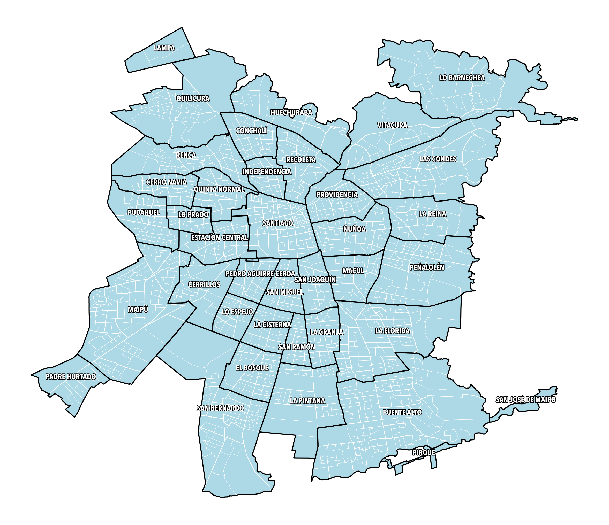

# Mapas Covid19, Chile

Autor: Diego Caro [@diegocaro](http://twitter.com/diegocaro/).

El objetivo de este repositorio es educacional. Contiene código para analizar
datos del Censo 2017 que puedan resultar necesarios para tomar decisiones
con respecto a la pandemia Covid-19 en Chile.

Los datos se han obtenido de las siguientes fuentes:
- http://www.censo2017.cl/servicio-de-mapas/

[Mapas Urbanos.ipynb]: lectura y procesamiento de cartografía urbana del Gran Santiago.

**Descargo de responsabilidad**: este repositorio no constituye información cartográfica oficial de la República de Chile. Su único fin es educativo, y no debe ser utilizado como referencia para decisiones oficiales sobre la pandemia.

Bajo Licencia [Mozilla Public Licence Version 2.0](https://mozilla.org/MPL/2.0/).